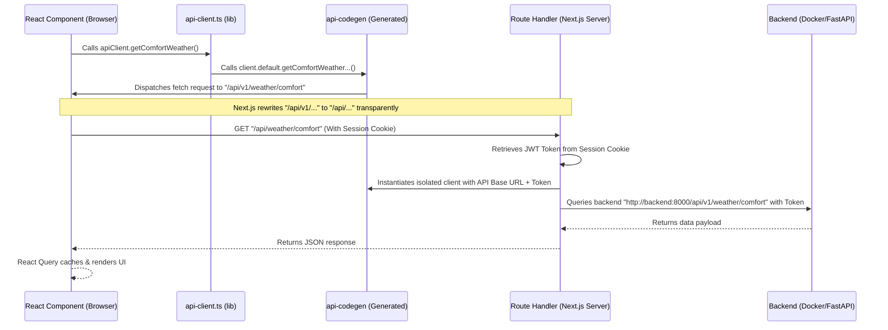

# Frontend Authentication & API Query Flow

This document details the step-by-step tracing of how frontend client queries are authenticated, proxied, and executed securely using the OpenAPI generated client.

---

## Architecture Overview



---

## Detailed Execution Steps

### 1. React Component Mounts & Triggers Query
Inside our dashboard view, React Query's `useQuery` hook executes the query function to fetch fresh data.
* **Source Location**: [dashboard-client.tsx](file:///Users/pubudushehan/Desktop/Programming/weather-comfort/frontend/components/dashboard-client.tsx)
* **Code Trace**:
  ```typescript
  const { data } = useQuery({
    queryKey: ['weatherComfort'],
    queryFn: apiClient.getComfortWeather, // <--- Triggers unified wrapper
  });
  ```

### 2. Custom API Wrapper Call
The browser client calls the re-export API wrapper. A client-side instance of `WeatherComfortClient` (which is configured to run relative requests by default) receives the command.
* **Source Location**: [api-client.ts](file:///Users/pubudushehan/Desktop/Programming/weather-comfort/frontend/lib/api-client.ts)
* **Code Trace**:
  ```typescript
  // Browser client instance (default BASE configuration is empty string)
  const clientInstance = new WeatherComfortClient();

  export const apiClient = {
    async getComfortWeather(): Promise<ComfortWeatherResponse> {
      // Calls generated Service method
      return clientInstance.default.getComfortWeatherApiV1WeatherComfortGet();
    }
  };
  ```

### 3. Codegen Client Request Generation
The generated `DefaultService` is called. Because the browser client was initialized without a custom base URL, it targets the relative path `/api/v1/...` on the frontend host.
* **Source Location**: [DefaultService.ts](file:///Users/pubudushehan/Desktop/Programming/weather-comfort/frontend/lib/api-codegen/services/DefaultService.ts)
* **Code Trace**:
  ```typescript
  public getComfortWeatherApiV1WeatherComfortGet(): CancelablePromise<ComfortWeatherResponse> {
      return this.httpRequest.request({
          method: 'GET',
          url: '/api/v1/weather/comfort', // <--- Dispatches relative browser request
      });
  }
  ```

### 4. Next.js Routing Direct Matching
Next.js receives the browser call directly at `/api/v1/weather/comfort`. Because we restructured the Route Handler folders under the `v1` subdirectory, Next.js natively routes the request without needing any rewrite configurations in `next.config.ts`.

### 5. Secure Route Handler Intercepts & Proxies Request
The Next.js Route Handler runs on the Node.js server. Since the browser request sends the encrypted session cookie automatically, the server retrieves the user's Auth0 JWT Access Token, instantiates an isolated server-side `WeatherComfortClient` instance pointing to the FastAPI backend container, and queries the backend.
* **Source Location**: [route.ts](file:///Users/pubudushehan/Desktop/Programming/weather-comfort/frontend/app/api/v1/weather/comfort/route.ts)
* **Code Trace**:
  ```typescript
  export async function GET() {
    // 1. Fetches access token from encrypted HttpOnly session cookie
    const { token } = await auth0.getAccessToken();
    const apiBaseUrl = process.env.API_BASE_URL || 'http://localhost:8000';

    // 2. Instantiates isolated client with access token (no server-side singleton pollution)
    const client = new WeatherComfortClient({
      BASE: apiBaseUrl,
      TOKEN: token,
    });

    // 3. Securely fetches data from the FastAPI container
    const data = await client.default.getComfortWeatherApiV1WeatherComfortGet();
    
    // 4. Forwards data payload back to browser client
    return NextResponse.json(data);
  }
  ```

### 6. FastAPI Backend Authorization
* FastAPI receives the request at `GET /api/v1/weather/comfort` containing the `Authorization: Bearer <JWT_token>` header.
* The backend Auth0 dependency middleware validates the signature and audience of the JWT token.
* On validation success, FastAPI returns the calculations, which Next.js forwards back to the browser React component.
